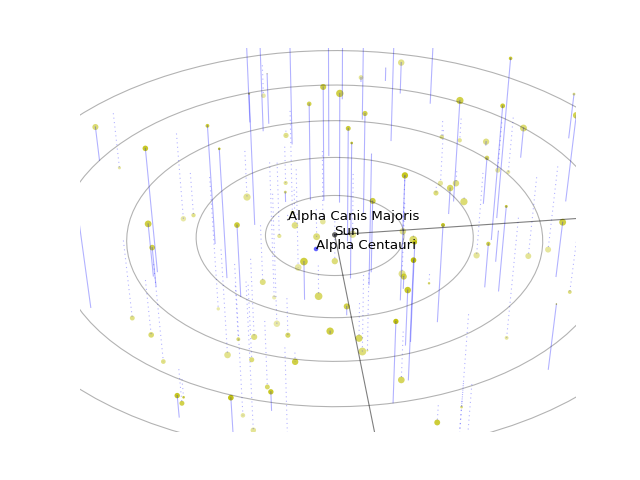

#StarPlot
--------

This repo is a short example of scraping the web, cleaning a bit of data with Pandas and Python,
and plotting the results in 3-D.

The example is the brighter stars within 50 lightyears. The plot can be turned around interactively.

Run the code by downloading the Python bit, and typing
python StarPlot.py

at the command line.  You'll have to be on the 'Net since it grabs the coordinates from 
http://www.atlasoftheuniverse.com/50lys.html

The result looks like this:

